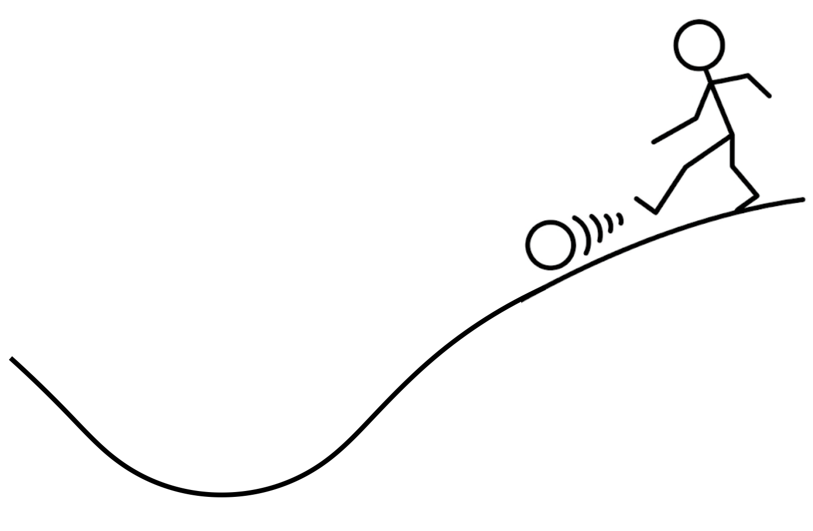

```{r}
#| label: setup
#| echo: false
#| message: false
#| warning: false
#| include: false

library(knitr)
library(ggplot2)
library(cowplot)
library(gganimate)
library(dplyr)
library(brms)

opts_chunk$set(echo = FALSE)

```


## Intro to Bayesian Statistics

<br><br>

That's the name of a whole course!

::: {.fragment}

<br>

*but here we go*

:::

## Likelihood is kinda awkward

We maximize 

$$
\mathbb{P}(\text{data} \mid \text{model params})
$$

and that tells us what parameters best fit the data

::: {.r-stack}

:::: {.fragment .fade-in-then-out}

<br>

*"find the parameters that maximize the probability of the data given those parameters"*

::::


:::: {.fragment .fade-in-then-out}

<br>

to understand uncertainty in parameter estimates we have to do a somewhat convoluted comparison to a $\chi^2$ distribution

::::

:::: {.fragment .fade-in-then-out}

<br>

but likelihood is important, and it is a natural way to think about models because it flows from how data would be generated from a given model

::::

:::

## Likelihood is kinda awkward

It just might be easier to interpret if we could flip the conditional

$$
\mathbb{P}(\text{model params} \mid \text{data})
$$


::: {.fragment .fade-in-then-out}

<br>

we can read this as just *"what is the probability of these parameters given the data?"*

:::


## Bayes

This probability has a special name in Bayesian statistics

$$
\mathbb{P}(\text{model params} \mid \text{data})
$$

it is the posterior


::: {.r-stack}

:::: {.fragment .fade-in-then-out}

::: {.columns}

:::: {.column}

it automatically encodes information about uncertainty: 

we can ask about the probability of ***any*** parameters, not just the most likely

::::

:::: {.column}

```{r}
#| echo: false
#| message: false
#| warning: false
#| fig-width: 4
#| fig-height: 3
#| fig-align: center

data.frame(x = rnorm(10000)) |> 
    filter(abs(x) < 3) |> 
ggplot(aes(x)) +
    geom_histogram() +
    xlab(expression(theta)) +
    ylab(expression(P*"(theta | data)")) +
    theme_cowplot() +
    theme(axis.text = element_blank(), 
          axis.title = element_text(size = 24))
    

```

::::


:::

::::


:::: {.fragment}

and we are often most interested in this question: how likely is my model given the data.

To get there with the likelihood we have to use a null hypothesis test and ask *"how likely is my model inference if the real model is null?"*

::::

:::: {.fragment}

***but we can get the posterior from the likelihood!*** *(with a little math)*

::::

:::

## Bayes

This is Bayes' Theorem, where Bayesian statistics gets its name

$$
\mathbb{P}(\theta \mid \text{data}) = \frac{\mathbb{P}(\text{data} \mid \theta) \mathbb{P}(\theta)}{\mathbb{P}(\text{data})}
$$

::: {.r-stack}

:::: {.fragment .fade-in-then-out}

<br>

the numerator is the likelihood times something new: 

*the prior* $\mathbb{P}(\theta)$

::::

:::: {.fragment .fade-in-then-out}

<br>

*the prior* $\mathbb{P}(\theta)$ represents our prior assumptions or knowledge about the value of the parameter(s) $\theta$

::::

:::


## The prior


Most often we want a *flat prior*, one that tries to make as few assumptions as possible

::: {.r-stack}

::: {.fragment .fade-in-then-out}


That's easy when our parameter is naturally bounded like the binomial $p$


```{r}
#| echo: false
#| message: false
#| warning: false
#| fig-width: 4
#| fig-height: 3
#| fig-align: center


ggplot(data.frame(x = 0:1), aes(x)) +
    xlim(c(-0.1, 1.1)) +
    stat_function(fun = dunif) +
    xlab("p") +
    ylab("Prob density") +
    theme_cowplot() +
    theme(axis.text = element_blank(), 
          axis.title = element_text(size = 24))
    

```

:::


::: {.fragment .fade-in-then-out}

But more difficult with unbounded $(-\infty, \infty)$ parameters like a slope $\beta$

We do our best by making distributions as broad as possible like $\mathcal{N}(\mu = 0, ~\sigma = 1,000)$, which is effectively flat

$$
\begin{aligned}
\mathbb{P}(0 < \beta < 100) &= `r pnorm(100, sd = 1000) - pnorm(0, sd = 1000)` \\
\mathbb{P}(100 < \beta < 200) &= `r pnorm(200, sd = 1000) - pnorm(100, sd = 1000)`
\end{aligned}
$$

:::


::: {.fragment}

But if we had genuine information about a realistic range of parameter values, a prior allows us to use that

:::

:::


## Bayes

If the posterior is easier to interpret, why don't we do Bayesian statistics more often?

$$
\mathbb{P}(\theta \mid \text{data}) = \frac{\mathbb{P}(\text{data} \mid \theta) \mathbb{P}(\theta)}{\mathbb{P}(\text{data})}
$$


::: {.incremental}

- the prior is a sticking point for some
- but the real issue is: the denominator $\mathbb{P}(\text{data})$ is a challenge
- what does it even mean?!

:::

## The "probability of the data" 

$\mathbb{P}(\text{data})$ is the sum of $\mathbb{P}(\text{data} \mid \theta)$ for all possible model parameterizations

$$
\mathbb{P}(\text{data} \mid \text{this } \theta) + \mathbb{P}(\text{data} \mid \text{that } \theta) + \cdots 
$$

::: {.fragment}

but we can't actually take a sum like this (it would be infinite) so formally

$$
\mathbb{P}(\text{data}) = \int_\theta \mathbb{P}(\text{data} \mid \theta)
$$

:::

## The "probability of the data" 

This "sum"

$$
\mathbb{P}(\text{data}) = \int_\theta \mathbb{P}(\text{data} \mid \theta)
$$

can be $\leq 1$ (the data are not guaranteed under our model)

::: {.fragment}

and outside of a few special cases it is impossible to calculate in closed form

:::

::: {.fragment}

but it is extremely important because without it the posterior $\mathbb{P}(\theta \mid \text{data})$ is not a proper probability, it could be $> 1$

:::

## So how do we get the posterior?

Even though we typically don't know $\mathbb{P}(\text{data})$ to normalize the posterior, we know the *shape* of the posterior

::: {.columns}

:::: {.column}

$\mathbb{P}(\text{data} | \theta) \mathbb{P}(\theta)$ gives the *shape*


```{r}
#| echo: false
#| message: false
#| warning: false
#| fig-width: 4
#| fig-height: 3
#| fig-align: center


d <- data.frame(x = seq(-2, 2, by = 0.01)) |> 
    mutate(y = 0.25 + dnorm(x, sd = 0.75))

post_shape <- ggplot(d, aes(x, y)) +
    geom_line() +
    geom_ribbon(aes(x, ymax = y), ymin = 0, 
                fill = hsv(0.08, 1, 0.8, alpha = 0.5)) +
    ylim(c(0, max(d$y))) +
    xlab(expression(theta)) +
    ylab(expression("P(data |"~theta*") P("*theta*")")) +
    theme_cowplot() +
    theme(axis.text = element_blank(), 
          axis.title = element_text(size = 24))

post_shape
```

::::

:::: {.column}

::: {.incremental}

- does not sum to 1 (not a proper probability)
- but *does* show regions where probability should be higher and lower
- for a single value of $\theta$ we always know $\mathbb{P}(\text{data} | \theta)$ and  $\mathbb{P}(\theta)$

:::

::::

:::

## So how do we get the posterior?

Use the shape of the posterior $\mathbb{P}(\text{data} | \theta) \mathbb{P}(\theta)$ to draw a random sample consistent with the posterior


::: {.incremental}

- Monte Carlo (MC) can do this without a proper $\mathbb{P}(\theta \mid \text{data})$
- by sampling values of $\theta$ in proportion to height the of $\mathbb{P}(\text{data} | \theta) \mathbb{P}(\theta)$

:::

::: {.fragment}

```{r}
#| echo: false
#| message: false
#| warning: false
#| fig-width: 5
#| fig-height: 3
#| fig-align: center

yhi <- dnorm(0, sd = 0.75) - 0.01

post_shape +
    annotate("text", x = 0, y = yhi, 
             label = "more\nhere", vjust = 0, size = 6) +
    annotate("text", x = 1.5, y = yhi, 
             label = "less\nhere", vjust = 0, size = 6) +
    annotate("segment", x = 0, xend = 0, y = yhi - 0.05, yend = 0, 
             size = 1, arrow = arrow(length = unit(0.3, "cm"))) +
    annotate("segment", x = 1.5, xend = 1.5, y = yhi - 0.05, yend = 0, 
             size = 1, arrow = arrow(length = unit(0.3, "cm")))
    
```

:::


## So how do we get the posterior?

Use the shape of the posterior $\mathbb{P}(\text{data} | \theta) \mathbb{P}(\theta)$ to draw a random sample consistent with the posterior


::: {.columns}

:::: {.column width=33%}

Sampling proportionately to $\mathbb{P}(\text{data} | \theta) \mathbb{P}(\theta)$

```{r}
#| echo: false
#| message: false
#| warning: false
#| fig-width: 4
#| fig-height: 3
#| fig-align: center

post_shape +
    annotate("text", x = 0, y = yhi, 
             label = "more\nhere", vjust = 0, size = 6) +
    annotate("text", x = 1.5, y = yhi, 
             label = "less\nhere", vjust = 0, size = 6) +
    annotate("segment", x = 0, xend = 0, y = yhi - 0.05, yend = 0, 
             size = 1, arrow = arrow(length = unit(0.3, "cm"))) +
    annotate("segment", x = 1.5, xend = 1.5, y = yhi - 0.05, yend = 0, 
             size = 1, arrow = arrow(length = unit(0.3, "cm")))
    
```

::::

:::: {.column width=33%}

::: {.fragment}

Yields a sample <br> of $\theta$ <br><br>


```{r}
#| echo: false
#| message: false
#| warning: false
#| fig-width: 4
#| fig-height: 3
#| fig-align: center

x <- rnorm(80, sd = 0.75)

ggplot(data.frame(x = x, y = rep(0.05, length(x))), aes(x, y)) +
    geom_jitter(width = 0, height = 0.05) +
    ylim(c(0, max(d$y))) +
    xlab(expression(theta)) +
    ylab("") +
    theme_cowplot() +
    theme(axis.text = element_blank(), 
          axis.title = element_text(size = 24), 
          axis.line.y = element_blank(), 
          axis.ticks.y = element_blank())

```

:::

::::

:::: {.column width=33%}

::: {.fragment}

That looks like it came from $\mathbb{P}(\theta \mid \text{data})$

```{r}
#| echo: false
#| message: false
#| warning: false
#| fig-width: 4
#| fig-height: 3
#| fig-align: center

set.seed(123)

post_hist <- post_shape +
    geom_histogram(data = data.frame(x = rnorm(10000, sd = 0.75)) |> 
                       filter(abs(x) < 2), 
                   aes(x, y = after_stat(density)), inherit.aes = FALSE)

post_hist    
```

:::

::::

:::


## Markov Chain Monte Carlo (MCMC)

MCMC is the method of choice for this task


::: {.columns}

:::: {.column}

::::: {.fragment}

Start with an initial <br> value for $\theta$

```{r}
#| echo: false
#| message: false
#| warning: false
#| fig-width: 4
#| fig-height: 3
#| fig-align: center

theta_i <- c(2, -1.5, 0.25)
yhi <- 0.15

gp_mcmc0 <- ggplot(data.frame(x = theta_i[1], y = yhi), aes(x, y)) +
    geom_point(size = 8) +
    xlim(c(-2, 2)) +
    ylim(c(0, 1)) +
    xlab(expression(theta)) +
    ylab("") +
    theme_cowplot() +
    theme(axis.text = element_blank(), 
          axis.title = element_text(size = 24), 
          axis.line.y = element_blank(), 
          axis.ticks.y = element_blank())

gp_mcmc0

```

:::::

::::

:::: {.column}

::::: {.fragment}

Somehow propose a new value using $\mathbb{P}(\text{data} \mid \theta) \mathbb{P}(\theta)$

```{r}
#| echo: false
#| message: false
#| warning: false
#| fig-width: 4
#| fig-height: 3
#| fig-align: center

gp_mcmc1 <- gp_mcmc0 +
    geom_curve(aes(x = theta_i[1], y = yhi, 
                   xend = theta_i[2] + 0.1, yend = yhi + 0.05), 
               arrow = arrow(), linewidth = 2) +
    geom_point(aes(x = theta_i[2], y = yhi), size = 8, 
               shape = 21, fill = "white")
    

gp_mcmc1 
```

:::::

::::

:::


## Markov Chain Monte Carlo (MCMC)

MCMC is the method of choice for this task


::: {.columns}

:::: {.column}


**Repeat!** with new value <br> of $\theta$ as starting point

```{r}
#| echo: false
#| message: false
#| warning: false
#| fig-width: 4
#| fig-height: 3
#| fig-align: center

gp_mcmc1 +
    geom_point(aes(x = theta_i[2], y = yhi), size = 8)

```


::::

:::: {.column}

::::: {.fragment}

Somehow propose a new value using $\mathbb{P}(\text{data} \mid \theta) \mathbb{P}(\theta)$

```{r}
#| echo: false
#| message: false
#| warning: false
#| fig-width: 4
#| fig-height: 3
#| fig-align: center

gp_mcmc2 <- gp_mcmc1 +
    geom_curve(aes(x = theta_i[2], y = yhi, 
                   xend = theta_i[3] - 0.125, yend = yhi - 0.025), 
               arrow = arrow(), linewidth = 2) +
    geom_point(aes(x = theta_i[2], y = yhi), size = 8) +
    geom_point(aes(x = theta_i[3], y = yhi), size = 8, 
               shape = 21, fill = "white")

gp_mcmc2
```

:::::

::::

:::

::: {.r-stack style="margin-top: -2em;"}


:::: {.fragment}

Do that enough and we get a sample from the posterior without ever knowing the equation for $\mathbb{P}(\theta \mid \text{data})$

::::

:::


## Markov Chain Monte Carlo (MCMC)

MCMC is the method of choice for this task


::: {.columns}

:::: {.column}


**Repeat!** with new value <br> of $\theta$ as starting point

```{r}
#| echo: false
#| message: false
#| warning: false
#| fig-width: 4
#| fig-height: 3
#| fig-align: center

gp_mcmc2 +
    geom_point(aes(x = theta_i[3], y = yhi), size = 8)

```


::::

:::: {.column}

::::: {.fragment}

Do that enough and we get a sample from the posterior...

```{r}
#| echo: false
#| message: false
#| warning: false
#| fig-width: 4
#| fig-height: 3
#| fig-align: center

data.frame(x = rnorm(10000, sd = 0.75)) |> 
    filter(abs(x) < 2) |> 
ggplot(aes(x)) +
    geom_histogram(fill = "gray80") +
    xlab(expression(theta)) +
    ylab(expression(P*"("*theta*" | data)")) +
    theme_cowplot() +
    theme(axis.text = element_blank(), 
          axis.title = element_text(size = 24)) +
    geom_jitter(
        data = data.frame(x = rnorm(80), y = rep(50, 80)) |> 
            filter(abs(x) < 2), 
        aes(x, y),
        width = 0, height = 25, inherit.aes = FALSE
    )
```

:::::

::::

:::


::: {.fragment style="margin-top: -1.5em; text-align: center;"}

...without ever knowing the equation for $\mathbb{P}(\theta \mid \text{data})$


:::

## Markov Chain Monte Carlo (MCMC)

Common MCMC algorithms include 

::: {.incremental}

- Gibbs sampler
- Metropolis-Hastings
- random walk Metropolis
- Hessian Monte Carlo
- No-U-Turns (NUTS)

:::

::: {.fragment}

NUTS is what the software *Stan* uses, which is under the hood of the R code we'll use

:::

## No-U-Turns algorithm

Imagine a kid kicking a ball in a hilly landscape

::: {.r-stack}

::: {.fragment}

{width=60% fig-align="center"}


most of the time, the ball ends up at the bottom of a hill

:::

::: {.fragment}

```{r}

par(bg = "transparent", mar = c(2.5, 2.5, 0, 0), mgp = c(1, 1, 0), cex = 2)
plot(1:10, type = "n", axes = FALSE, 
     xlab = expression(theta), 
     ylab = expression(-log(P*"(data |"*theta*")"*P(theta)))) 
axis(2, labels = NA, lwd = 4)
axis(1, labels = NA, lwd = 4)
text(1, 8, labels = "let elevation be\ninverse of posterior", 
     cex = 1.25, adj = 0)

```

:::

:::

## No-U-Turns algorithm

A ball moving around the $-\log(\mathbb{P}(\text{data} \mid \theta) \mathbb{P}(\theta))$ landscape according to the laws of physics is basically Hamiltonian MC

::: {.fragment}

No-U-Turns just makes HMC more computationally efficient

:::

## No-U-Turns algorithm

```{r}
#| label: nuts-setup
#| cache: true

nuts <- function(f, epsilon, theta0, logp0 = NULL, grad0 = NULL, 
                 max_tree_depth = 10) {
    nfevals <- 0
    trajectory <- matrix(theta0, nrow = 1)
    
    if(is.null(logp0) || is.null(grad0)) {
        result <- f(theta0)
        logp0 <- result$logp
        grad0 <- result$grad
        nfevals <- nfevals + 1
    }
    
    r0 <- rnorm(length(theta0))
    joint <- logp0 - 0.5 * sum(r0^2)
    logu <- joint - rexp(1)
    H <- -logp0 + 0.5 * sum(r0^2)
    
    thetaminus <- theta0; thetaplus <- theta0
    rminus <- r0
    rplus <- r0
    gradminus <- grad0
    gradplus <- grad0
    
    depth <- 0
    theta <- theta0
    grad <- grad0
    logp <- logp0
    n <- 1
    stop <- FALSE
    alpha <- NULL
    nalpha <- NULL
    
    while(!stop) {
        dir <- 2 * (runif(1) < 0.5) - 1
        
        if(dir == -1) {
            bt <- build_tree(thetaminus, rminus, gradminus, logu, dir, 
                             depth, epsilon, f, joint, nfevals, trajectory, 
                             H)
            nfevals <- bt$nfevals
            trajectory <- bt$trajectory
            H <- bt$H
            thetaminus <- bt$thetaminus
            rminus <- bt$rminus
            gradminus <- bt$gradminus
        } else {
            bt <- build_tree(thetaplus, rplus, gradplus, logu, dir, 
                             depth, epsilon, f, joint, nfevals, trajectory, 
                             H)
            nfevals <- bt$nfevals
            trajectory <- bt$trajectory
            H <- bt$H
            thetaplus <- bt$thetaplus
            rplus <- bt$rplus
            gradplus <- bt$gradplus
        }
        
        if (!bt$stopprime && (runif(1) < bt$nprime / n)) {
            theta <- bt$thetaprime
            logp  <- bt$logpprime
            grad  <- bt$gradprime
        }
        
        n <- n + bt$nprime
        stop <- bt$stopprime || 
            stop_criterion(thetaminus, thetaplus, rminus, rplus)
        depth <- depth + 1
        alpha <- bt$alphaprime
        nalpha <- bt$nalphaprime
        
        if(depth > max_tree_depth) {
            message("The current NUTS iteration reached max tree depth")
            break
        }
    }
    
    out_df <- data.frame(trajectory)
    names(out_df) <- c("theta1", "theta2")
    rownames(out_df) <- NULL
    
    out_df$selected <- FALSE
    out_df$selected[theta[1] == out_df$theta1 & 
                        theta[2] == out_df$theta2] <- TRUE
    
    return(out_df)
}

leapfrog <- function(theta, r, grad, epsilon, f, 
                     nfevals, trajectory, H) {
    rprime <- r + 0.5 * epsilon * grad
    thetaprime <- theta + epsilon * rprime
    result <- f(thetaprime)
    rprime <- rprime + 0.5 * epsilon * result$grad
    trajectory <- rbind(trajectory, thetaprime)
    H <- c(H, -result$logp + 0.5 * sum(rprime^2))
    list(thetaprime = thetaprime, 
         rprime = rprime, 
         gradprime = result$grad,
         logpprime = result$logp, 
         nfevals = nfevals + 1, 
         trajectory = trajectory,
         H = H)
}

stop_criterion <- function(thetaminus, thetaplus, rminus, rplus) {
    thetavec <- thetaplus - thetaminus
    (sum(thetavec * rminus) < 0) || (sum(thetavec * rplus) < 0)
}

build_tree <- function(theta, r, grad, logu, dir, depth, epsilon, 
                       f, joint0, nfevals, trajectory, H) {
    if(depth == 0) {
        lf <- leapfrog(theta, r, grad, dir * epsilon, f, 
                       nfevals, trajectory, H)
        nfevals <- lf$nfevals
        trajectory <- lf$trajectory
        H <- lf$H
        joint <- lf$logpprime - 0.5 * sum(lf$rprime^2)
        nprime <- as.integer(logu < joint)
        stopprime <- (logu - 100) >= joint
        alphaprime <- exp(lf$logpprime - 0.5 * sum(lf$rprime^2) - joint0)
        
        if(is.nan(alphaprime)) {
            alphaprime <- 0 
        } else { 
            alphaprime <- min(1, alphaprime)
        }
        
        list(thetaminus = lf$thetaprime, 
             rminus = lf$rprime, 
             gradminus = lf$gradprime,
             thetaplus  = lf$thetaprime, 
             rplus  = lf$rprime, 
             gradplus  = lf$gradprime,
             thetaprime = lf$thetaprime, 
             gradprime = lf$gradprime,
             logpprime = lf$logpprime, 
             nprime = nprime, 
             stopprime = stopprime,
             alphaprime = alphaprime, 
             nalphaprime = 1, 
             nfevals = nfevals,
             trajectory = trajectory, 
             H = H)
    } else {
        bt <- build_tree(theta, r, grad, logu, dir, depth - 1, 
                         epsilon, f, joint0, nfevals, trajectory, H)
        nfevals <- bt$nfevals
        trajectory <- bt$trajectory
        H <- bt$H
        
        thetaminus <- bt$thetaminus
        rminus <- bt$rminus
        gradminus <- bt$gradminus
        thetaplus  <- bt$thetaplus
        rplus  <- bt$rplus
        gradplus  <- bt$gradplus
        thetaprime <- bt$thetaprime
        gradprime <- bt$gradprime
        logpprime <- bt$logpprime
        nprime <- bt$nprime
        stopprime <- bt$stopprime
        alphaprime <- bt$alphaprime
        nalphaprime <- bt$nalphaprime
        
        if (!stopprime) {
            if(dir == -1) {
                bt2 <- build_tree(thetaminus, rminus, gradminus, logu, 
                                  dir, depth - 1, epsilon, f, joint0, 
                                  nfevals, trajectory, H)
                thetaminus <- bt2$thetaminus
                rminus <- bt2$rminus
                gradminus <- bt2$gradminus
            } else {
                bt2 <- build_tree(thetaplus, rplus, gradplus, logu, 
                                  dir, depth - 1, epsilon, f, joint0, 
                                  nfevals, trajectory, H)
                thetaplus <- bt2$thetaplus
                rplus <- bt2$rplus
                gradplus <- bt2$gradplus
            }
            
            nfevals <- bt2$nfevals
            trajectory <- bt2$trajectory
            H <- bt2$H
            
            if(runif(1) < bt2$nprime / (nprime + bt2$nprime)) {
                thetaprime <- bt2$thetaprime
                gradprime  <- bt2$gradprime
                logpprime  <- bt2$logpprime
            }
            nprime    <- nprime + bt2$nprime
            stopprime <- stopprime || bt2$stopprime ||
                stop_criterion(thetaminus, thetaplus, rminus, rplus)
            alphaprime  <- alphaprime + bt2$alphaprime
            nalphaprime <- nalphaprime + bt2$nalphaprime
        }
        
        list(thetaminus = thetaminus, 
             rminus = rminus, 
             gradminus = gradminus,
             thetaplus  = thetaplus,  
             rplus  = rplus,  
             gradplus  = gradplus,
             thetaprime = thetaprime, 
             gradprime = gradprime,
             logpprime = logpprime, 
             nprime = nprime, 
             stopprime = stopprime,
             alphaprime = alphaprime, 
             nalphaprime = nalphaprime, 
             nfevals = nfevals,
             trajectory = trajectory, 
             H = H)
    }
}


f_mvn <- function(theta) {
    logp <- -0.5 * sum(theta^2)
    grad <- -theta
    list(logp = logp, grad = grad)
}


set.seed(1)
nuts_run <- vector("list", 10)

for(i in 1:length(nuts_run)) {
    if(i == 1) {
        t0 <- c(1, 1)
    } else {
        t0 <- filter(nuts_run[[i - 1]], selected)
        t0 <- c(t0[1, 1], t0[1, 2])
    }
    
    tnew <- nuts(f_mvn, 0.1, t0)
    tnew$run <- i
    
    nuts_run[[i]] <- tnew
}

nuts_run <- do.call(rbind, nuts_run)

theta_max <- range(nuts_run[, 1:2]) |> 
    abs() |> 
    max()

thetas <- expand.grid(theta1 = seq(-theta_max, theta_max, length.out = 80), 
                      theta2 = seq(-theta_max, theta_max, length.out = 80))


thetas$logp <- sapply(split(thetas, seq(nrow(thetas))), function(m) {
    f_mvn(m)$logp
})

```

::: {.columns}

:::: {.column width=40%}

Here is a landscape with two parameters

::::

:::: {.column width=60%}

```{r}
#| echo: false
#| message: false
#| warning: false
#| fig-width: 6
#| fig-height: 6
#| fig-align: center

gp_lscape <- ggplot(thetas, aes(theta1, theta2, fill = logp)) + 
    geom_tile() +
    scale_fill_viridis_c() +
    scale_x_continuous(expand = FALSE) +
    scale_y_continuous(expand = FALSE) +
    theme(legend.position = "none", 
          axis.text = element_blank(), 
          axis.title = element_text(size = 30)) +
    xlab(expression(theta[1])) +
    ylab(expression(theta[2])) 

gp_lscape

```

::::

:::


## No-U-Turns algorithm

::: {.columns}

:::: {.column width=40%}

Starting from some initial location, NUTS proposes new parameter values by kicking a ball and seeing where it rolls on the landscape

::::

:::: {.column width=60%}

```{r}
#| echo: false
#| message: false
#| warning: false
#| fig-width: 6
#| fig-height: 6
#| fig-align: center

gp_lscape +
    geom_point(data = nuts_run[nuts_run$run == 1, ], 
               aes(theta1, theta2), 
               size = 4, shape = 21, fill = "white",
               inherit.aes = FALSE) +
    geom_point(data = nuts_run[1, ], 
               aes(theta1, theta2), 
               size = 4,
               inherit.aes = FALSE)

```

::::

:::


## No-U-Turns algorithm

::: {.columns}

:::: {.column width=40%}

A new set of parameter values along the path of the ball is randomly choosen, and the algorithm repeated

::::

:::: {.column width=60%}

```{r}
#| echo: false
#| message: false
#| warning: false
#| fig-width: 6
#| fig-height: 6
#| fig-align: center

gp_lscape +
    geom_point(data = nuts_run[nuts_run$run == 1, ], 
               aes(theta1, theta2), 
               size = 4, shape = 21, fill = "white",
               inherit.aes = FALSE) +
    geom_point(data = nuts_run[1, ], 
               aes(theta1, theta2), 
               size = 4,
               inherit.aes = FALSE) +
    geom_point(data = nuts_run[nuts_run$run == 1 & nuts_run$selected, ], 
               aes(theta1, theta2), 
               size = 4,
               inherit.aes = FALSE) 

```

::::

:::


## No-U-Turns algorithm

::: {.columns}

:::: {.column width=40%}

Eventually a sample of the posterior emerges

::::

:::: {.column width=60%}

```{r}
#| label: nuts-anni
#| echo: false
#| message: false
#| warning: false
#| fig-width: 6
#| fig-height: 6
#| fig-align: center
#| cache: true

ggplot(filter(nuts_run), aes(theta1, theta2, color = selected)) +
    geom_tile(data = thetas, aes(theta1, theta2, fill = logp), 
              inherit.aes = FALSE) + 
    scale_fill_viridis_c() +
    geom_point(size = 4) +
    scale_color_discrete(palette = c("white", "black")) +
    scale_x_continuous(expand = FALSE) +
    scale_y_continuous(expand = FALSE) +
    theme(legend.position = "none", 
          axis.text = element_blank(), 
          axis.title = element_text(size = 30)) +
    xlab(expression(theta[1])) +
    ylab(expression(theta[2])) +
    transition_states(run,
                      transition_length = 0,
                      state_length = 1.5) +
    enter_fade() +
    exit_shrink() +
    ease_aes('sine-in-out')

```

::::

:::

## Package *brms* makes it easy for us

Despite the complexities of how this works under the hood, *brms* will make it feel familiar

```{r}
#| label: brm-run
#| cache: true
#| include: false

x <- runif(100, 0, 1)
mu <- exp(-2 + 4 * x)
y <- rpois(length(x), mu)
dat <- data.frame(x, y)

m <- brm(y ~ x, data = dat, 
         family = poisson(), 
         prior = c(prior(normal(0, 1000), class = Intercept),
                   prior(normal(0, 1000), class = b)))

```

```{r}
#| eval: false
#| echo: true

library(brms)

x <- runif(100, 0, 1)
mu <- exp(-2 + 4 * x)
y <- rpois(length(x), mu)
dat <- data.frame(x, y)

m <- brm(y ~ x, data = dat, 
         family = poisson(), 
         prior = c(prior(normal(0, 1000), class = Intercept),
                   prior(normal(0, 1000), class = b)))

```

## Package *brms* makes it easy for us

Despite the complexities of how this works under the hood, *brms* will make it feel familiar

```{r}
#| label: fixef-wtf
#| echo: true

# see the fixed coefficients
fixef(m)
```

::: {.fragment}

We'll get deep into this in the labs!

:::

## Bayesian statistics for the pragmatist

::: {.incremental}

- there are big philosophical differences between Bayesian and "frequentist" statistics
- no need to go there
- and although the posterior probably is how we think about science
- practically speaking the methods of frequentist statistics are computationally easier
- however, there are some models that can *only* be fit with Bayesian methods (as we will soon see)

:::


<!-- don't forget: more data, further from prior we go FOR A LAB!!!!-->
