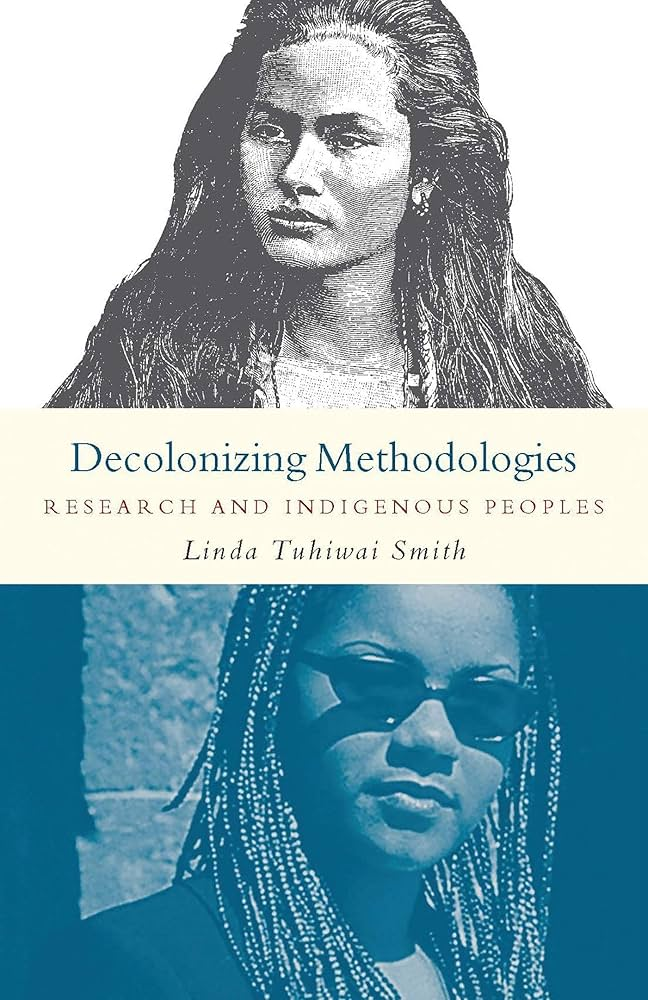
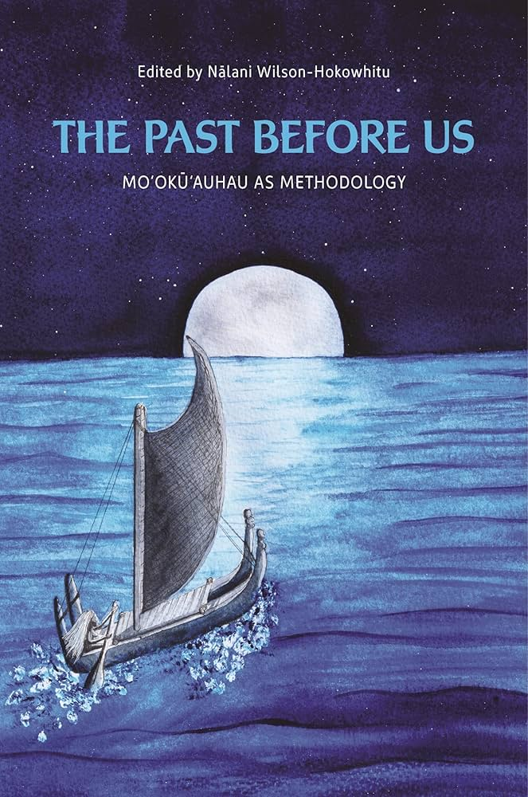
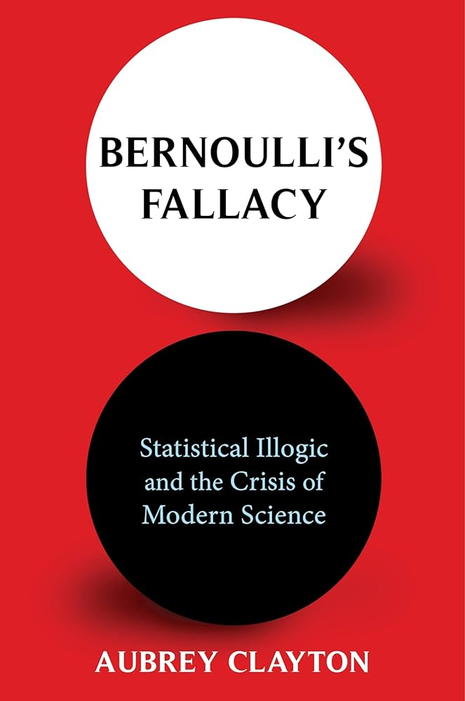
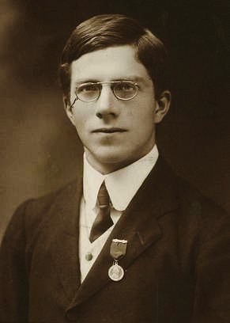
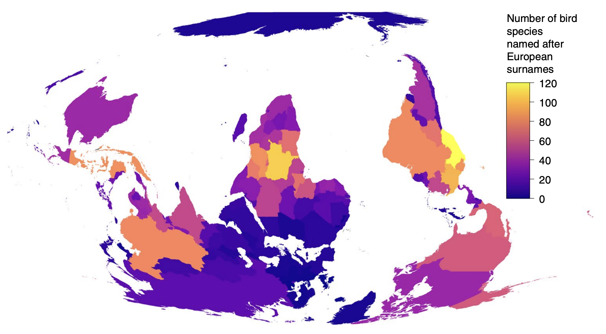
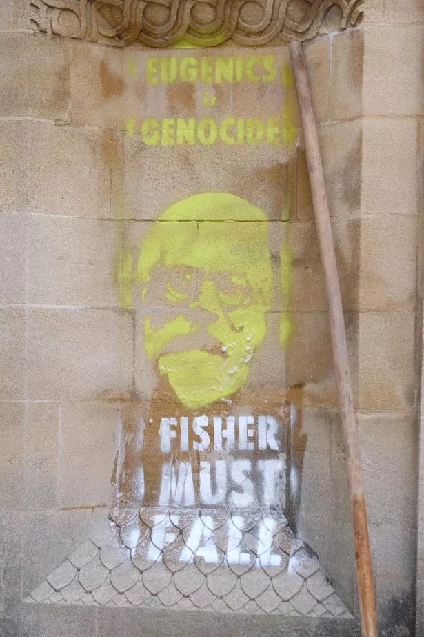

```{r}
#| label: setup
#| echo: false
#| message: false
#| warning: false


library(ggplot2)
library(knitr)
library(cowplot)

opts_chunk$set(echo = FALSE)
```


## {.center}

::: {.r-fit-text}
What is a model?
:::


## {.center}

::: {.r-fit-text}
Question $\rightarrow$ Model
:::


## What questions do we ask and why?

Our knowledge systems guide what questions we see as interesting and relevant. Western epistemology is only one [@tuhiwai2012; @wilson2019] 

::: {.columns}

:::: {.column}

{width="50%" fig-align="center"}


::::

:::: {.column}

{width="50%" fig-align="center"}

::::

:::


## What questions do we ask and *how*?

What methods are deemed valid, "objective," "quantitative" has a history of racism, colonialism, and extraction [@tuhiwai2012; @clayton2021] 

::: {.columns}

:::: {.column}

{width="50%" fig-align="center"}


::::

:::: {.column}

{width="50%" fig-align="center"}

::::

:::


## Moʻokūʻauhau of likelihood

::: {.columns}

:::: {.column width=20%}


::::

:::: {.column width=80%}


::: {.incremental}
- proposed likelihood methods starting in 1912
- racist
- eugenicist
- pawn of big tobacco

:::

::::

:::


## Moʻokūʻauhau of likelihood

::: {.columns}

:::: {.column width=20%}


::::

:::: {.column width=80%}

::::: {.r-stack}

::: {.fragment .fade-in-then-out}

> Available scientific knowledge provides a firm basis for believing that the groups of mankind differ in their innate capacity for intellectual and emotional development.

:::

::: {.fragment .fade-in-then-out}

> I am sorry that there should be propaganda in favour of miscegenation [bigoted term for marriage between perceived racial groups] *in North America as I am sure it can do nothing but harm.

:::

::: {.fragment .fade-in-then-out}

> Unfortunately, considerable propaganda is now being developed to convince the public that cigarette smoking is dangerous [Fisher was funded by the tobacco industry]

:::

:::::

::::

:::


## What do we do about it?

:::: {.r-stack}

::: {.fragment .fade-in-then-out}

Consider this: European names are assigned (by some) to organisms the world over [@trisos2021], but the named people do not own those organism

Statistical methods were developed as tools for extraction and discrimination, but the racists and colonizers don't own them

::: {.columns}

:::: {.column}

{fig-align="center"}

::::

:::: {.column}

{width="35%" fig-align="center"}

::::

:::


:::


::: {.fragment .fade-in-then-out}

Being self-reflective about what questions we ask, how, and why can help us make use of the tools while pushing back against their original uses

:::

::: {.fragment .fade-in-then-out}

Being able to use these tools, and be ethical about it, will help you get a job, and make a positive change with your position

:::

::::


## With all that said

::: {.stack}

::: {.r-fit-text}
Question $\rightarrow$ Model
:::

:::

## With all that said

::: {.stack}

::: {.r-fit-text}
Question $\rightarrow$ Predictions $\rightarrow$ Model
:::

:::

## Question to prediction

What is the effect of $x$ on $y$?

::: {.incremental}

- ***prediction:*** if $x$ goes up $y$ goes down
- ***prediction:*** $y$ is greater for group $x = g_1$ vs. $x = g_2$

:::

::: {.fragment}

Making a conceptual graph can help

:::


## Question to prediction

What is the effect of $x$ on $y$?

::: {.columns}

:::: {.column}

```{r}
#| fig-width: 4
#| fig-height: 4
#| fig-align: center

ggplot(data.frame(x = 0:2, y = 0:2), aes(x, y)) +
    ylim(c(0.5, 2.5)) +
    geom_function(fun = \(x) 2 - 0.5 * x, 
                  linewidth = 2, color = hsv(0.52, 1, 0.7)) +
    theme_classic() + 
    theme(axis.title = element_text(size = 22, face = "italic"), 
          axis.ticks = element_blank(), 
          axis.text = element_blank())

```

::::

:::: {.column}


```{r}
#| fig-width: 4
#| fig-height: 4
#| fig-align: center

bp <- ggplot(data.frame(x = rep(c("g1", "g2"), each = 4), y = c(1:4, 4:7)), aes(x, y)) +
    geom_boxplot(color = hsv(0.52, 1, 0.7)) +
    theme_classic() + 
    theme(axis.title = element_text(size = 22, face = "italic"), 
          axis.ticks = element_blank(), 
          axis.text = element_blank())

bp

```

::::


:::

## Prediction to model

What is the source of variability?

```{r}
#| fig-width: 4
#| fig-height: 4
#| fig-align: center


bp

```


## Prediction to model

What is the source of variability?

::: {.columns}

:::: {.column}

::: {.fragment}

Biological

::: {.incremental}
- lots of little additive or multiplicative processes <br> $\rightarrow$ central limit theorem and **normal**
- random birth and death <br> $\rightarrow$ **Poisson** (technically negative binomial) or **Binomial** 


:::

:::

::::

:::: {.column}

::: {.fragment}

Sampling and measurement

::: {.incremental}
- imprecise measurement <br> $\rightarrow$ central limit theorem and **normal**
- imperfect detection <br> $\rightarrow$ **binomial**


:::

:::

::::


:::


## How to make a model

For purposes of using maximum likelihood, it's all about connecting a question to predictions and imagining how those predictions could be different---from one observation to the next, or one experiment to the next---based on random chance.


## References


