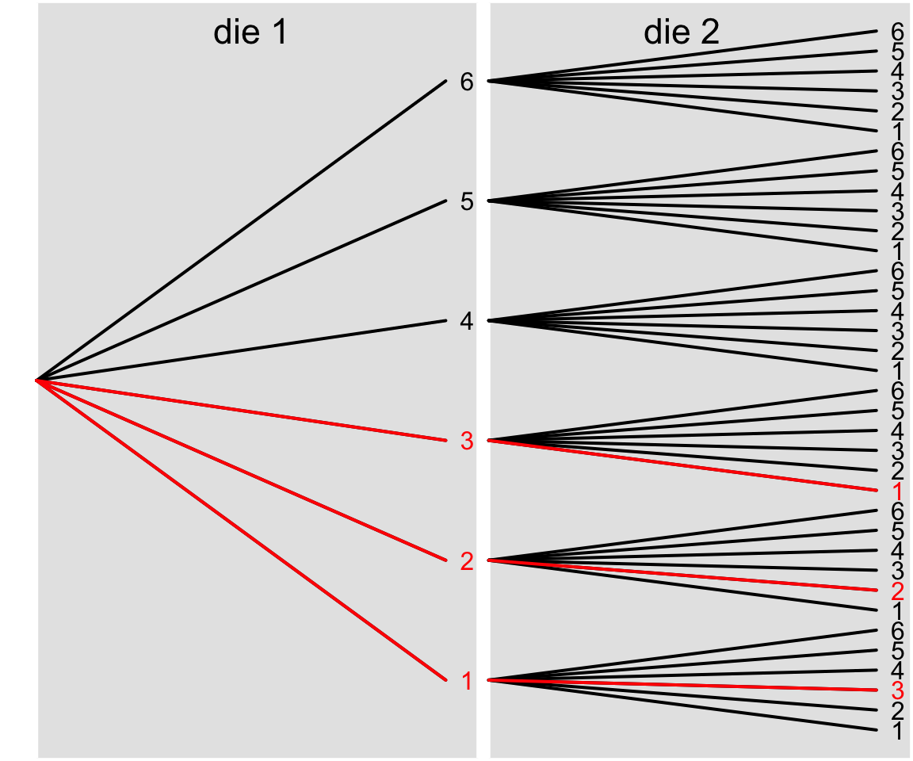

```{r}
#| label: setup
#| echo: false
#| message: false
#| warning: false


library(ggplot2)
library(knitr)
library(dplyr)
library(magick)
library(grid)
library(ape)

opts_chunk$set(echo = FALSE, 
                      message = FALSE, 
                      warning = FALSE)
```


## Probability in ecology and evolution

```{r}
#| label: game-setup
#| cache: true
#| include: false


brev <- image_read("img/prob/t_brevignatha.png") |> 
    image_transparent("white", fuzz = 10)
kama <- image_read("img/prob/t_kamakou.png") |> 
    image_transparent("white", fuzz = 10)
kiko <- image_read("img/prob/t_kikokiko.png") |> 
    image_transparent("white", fuzz = 10)
macr <- image_read("img/prob/t_macracantha.png") |> 
    image_transparent("white", fuzz = 10)
quas <- image_read("img/prob/t_quasimodo.png") |> 
    image_transparent("white", fuzz = 10)
rest <- image_read("img/prob/t_restricta.png") |> 
    image_transparent("white", fuzz = 10)
waik <- image_read("img/prob/t_waikamoi.png") |> 
    image_transparent("white", fuzz = 10)


nanana <- c("brev", "kama", "kiko", "macr", 
            "quas", "rest", "waik")
xy <- expand.grid(x = 1:6, y = 1:6)

set.seed(3)
s <- c(nanana, 
       sample(nanana, size = nrow(xy) - length(nanana), replace = TRUE))

grid.newpage()
pushViewport(viewport(xscale = c(0.2, 6.8), yscale = c(0.2, 6.8)))


for(i in 1:nrow(xy)) {
    grid.rect(x = xy$x[i], y = xy$y[i], 
              width = 1, height = 1, 
              default.units = "native")
    
    grid.text(as.numeric(xy[i, ]), c(xy$x[i], 0.25), c(0.25, xy$y[i]), 
              default.units = "native",
              hjust = 0, vjust = 0, gp = gpar(fontsize = 22))
    get(s[i]) |>
        grid.raster(x = xy$x[i], y = xy$y[i],
                    height = 0.9,
                    default.units = "native")
}

g <- grid.grab()
```

::: {.columns}

:::: {.column width="65%"}

- pick a random grid cell with *equal* ***probability***
- replace with either:
    - dispersal from metacommunity with ***probability*** $m$, ...or...
    - local birth with ***probability*** $1 - m$
- choose replacement individual with *equal* ***probability***
- replacement undergoes speciation with ***probability*** $\nu$

::::

:::: {.column width="35%"}

```{r}
#| label: game-show-1
#| fig-width: 6
#| fig-height: 6
#| fig-align: center
#| fig-cap: |
#|     See end of slide deck for image credits

grid.newpage()
grid.draw(g)
```

::::

:::


## Probability in ecology and evolution

::: {.columns}

:::: {.column width="65%"}

- This "game" is a simplified version of Hubbell's [-@hubbell2001] Unified Neutral Theory of Biodiversity (UNTB)
- Even the full theory is a simplification of the real world, but can still predict, with surprising accuracy, properties of biodiversity like the species abundance distribution 
- UNTB and other models shows us the importance of probability and randomness

::::

:::: {.column width="35%"}

```{r}
#| label: game-show-3
#| fig-width: 6
#| fig-height: 6
#| fig-align: center
#| fig-cap: |
#|     See end of slide deck for image credits

grid.newpage()
grid.draw(g)
```


::::

:::


## Probability in ecology and evolution

::: {.columns}

:::: {.column width="65%"}

How could we play this "game" using just two 6-sided dice?

```{r}
#| label: dice
#| fig-width: 4
#| fig-height: 2
#| fig-align: center
#| eval: false

grid.newpage()

pushViewport(viewport(x = unit(0.25, units = "npc"), 
                      y = unit(0.5, units = "npc"), 
                      width = unit(0.4, "npc"), 
                      height = unit(0.8, "npc")))
grid.roundrect()
grid.points(x = c(0.25, 0.5, 0.74), 
            y = c(0.25, 0.5, 0.74), 
            pch = 16, size = unit(0.25, units = "npc"))

popViewport()


pushViewport(viewport(x = unit(0.75, units = "npc"), 
                      y = unit(0.5, units = "npc"), 
                      width = unit(0.4, "npc"), 
                      height = unit(0.8, "npc")))
grid.roundrect()
grid.points(x = c(0.25, 0.5, 0.75, 0.75, 0.25), 
            y = c(0.25, 0.5, 0.75, 0.25, 0.75), 
            pch = 16, size = unit(0.25, units = "npc"))
```

```{=html}
<div style="text-align: center;">
  <svg id="dice" width="300" height="150" style="cursor: pointer;">
    <!-- Dice will be drawn here -->
  </svg>
  <p id="sum" style="font-size: 24px; margin-top: 20px;"></p>
</div>

<script>
const svg = document.getElementById('dice');

function drawDie(x, y, value) {
  const size = 80;
  const dotRadius = 8;
  const dotColor = '#000';
  
  // Draw die background
  const rect = document.createElementNS('http://www.w3.org/2000/svg', 'rect');
  rect.setAttribute('x', x);
  rect.setAttribute('y', y);
  rect.setAttribute('width', size);
  rect.setAttribute('height', size);
  rect.setAttribute('fill', 'white');
  rect.setAttribute('stroke', 'black');
  rect.setAttribute('stroke-width', '2');
  rect.setAttribute('rx', '5');
  svg.appendChild(rect);
  
  // Dot positions for each value
  const dots = {
    1: [[0.5, 0.5]],
    2: [[0.25, 0.25], [0.75, 0.75]],
    3: [[0.25, 0.25], [0.5, 0.5], [0.75, 0.75]],
    4: [[0.25, 0.25], [0.75, 0.25], [0.25, 0.75], [0.75, 0.75]],
    5: [[0.25, 0.25], [0.75, 0.25], [0.5, 0.5], [0.25, 0.75], [0.75, 0.75]],
    6: [[0.25, 0.25], [0.75, 0.25], [0.25, 0.5], [0.75, 0.5], [0.25, 0.75], [0.75, 0.75]]
  };
  
  // Draw dots
  dots[value].forEach(([dx, dy]) => {
    const circle = document.createElementNS('http://www.w3.org/2000/svg', 'circle');
    circle.setAttribute('cx', x + dx * size);
    circle.setAttribute('cy', y + dy * size);
    circle.setAttribute('r', dotRadius);
    circle.setAttribute('fill', dotColor);
    svg.appendChild(circle);
  });
}

function rollDice() {
  // Clear previous dice
  svg.innerHTML = '';
  
  // Roll two dice
  const die1 = Math.floor(Math.random() * 6) + 1;
  const die2 = Math.floor(Math.random() * 6) + 1;
  
  // Draw dice
  drawDie(60, 45, die1);
  drawDie(160, 45, die2);
  
}

// Initial roll
rollDice();

// Roll on click
svg.addEventListener('click', rollDice);
</script>
```


*Let:*

- $m = \frac{1}{3}$
- $\nu = \frac{1}{36}$

::::

:::: {.column width="35%"}

```{r}
#| label: game-show-2
#| fig-width: 6
#| fig-height: 6
#| fig-align: center
#| fig-cap: |
#|     See end of slide deck for image credits

grid.newpage()
grid.draw(g)
```


::::

:::


## Rules of probability

We learned some in the game

- Probabilities sum to 1 (something has to happen)
- Probabilities add (prob. this ***or*** that = $\mathbb{P}(this) + \mathbb{P}(that)$)
- Probabilities multiply (prob. this ***and*** that = $\mathbb{P}(this) \mathbb{P}(that)$)
- But not always...

...Consider this: *probability* of speciation $\nu = 1/12$


## Rules of probability

Consider this: *probability* of speciation $\nu = 1/12$ 

Can achieve this with sum of two dice = 4

1 + 3 = 4 (prob = 1/36)

2 + 2 = 4 (prob = 1/36)

3 + 1 = 4 (prob = 1/36)

Total prob = 3/23 = 1/12


## Rules of probability

Consider this: *probability* of speciation $\nu = 1/12$ 

A probability tree can help

```{r}
#| label: prob-tree-prep
#| include: false

d <- paste(1:6, collapse = ", ")
dd <- paste(paste0("(", rep(d, 6), ")"), collapse = ", ")

tre <- read.tree(text = sprintf("(%s);", dd))
plot(tre)

foo <- get("last_plot.phylo", envir = .PlotPhyloEnv)

xy <- cbind(foo$xx, foo$yy)
frm <- xy[foo$edge[, 1], ]
tto <- xy[foo$edge[, 2], ]

frm[frm[, 1] == 30, 1] <- 2.1
tto[tto[, 1] == 30, 1] <- 1.9
tto[tto[, 1] == 35, 1] <- 3.9


d1 <- foo$edge[, 1] - min(foo$edge[, 1])
d2 <- tto[, 2] %% 6
d2[d2 == 0] <- 6

success <- d1 + d2 == 4 | (tto[, 2] < 20 & frm[, 1] < 2)
```

```{r}
#| label: prob-tree
#| fig-width: 6
#| fig-height: 5
#| fig-align: center
#| cache: true

par(mar = rep(0.1, 4), lwd = 2)
plot(rbind(frm, tto), type = "n", axes = FALSE)

rect(0, -1, 2.05, 100, col = "gray90", border = "white")
rect(2.1, -1, 10, 100, col = "gray90", border = "white")

text(1, 36, label = "die 1", cex = 1.4)
text(3, 36, label = "die 2", cex = 1.4)

segments(frm[, 1], frm[, 2],  tto[, 1], tto[, 2])
text(2, seq(3.5, 33.5, by = 6), labels = 1:6, 
     col = rep(c("red", "black"), each = 3))
text(4, 1:36, labels = rep(1:6, 6), 
     col = c(rep("black", 2), "red", rep("black", 4), "red", 
             rep("black", 4), "red", rep("black", 21)))


segments(frm[success, 1], frm[success, 2],  
         tto[success, 1], tto[success, 2], 
         col = "red")
```

Count up the ways to get sum of two dice = 4, divide by total number of combinations


## Rules of probability

Consider this: *probability* of speciation $\nu = 1/12$ 

::: {.columns}

:::: {.column}

Imagine: speciation occurred! What is the probability the first dice was 2 or less? 

- Can no longer *simply* add $\mathbb{P}(1) + \mathbb{P}(2) = 2/6 = 1/3$ 
- Use the probability tree

::::

:::: {.column}



::::

:::


This is *conditional probability*: probability of *first die* $\leq2$ **given** sum of two dice is 4

$$
\mathbb{P}(die_1 \leq 2 \mid sum = 4)
$$


## Rules of probability

Consider this: *probability* of speciation $\nu = 1/12$ 

::: {.columns}

:::: {.column}

Imagine: speciation occurred! What is the probability the first dice was 2 or less? 

$$
\mathbb{P}(die_1 \leq 2 \mid sum = 4) = \frac{2}{3}
$$

Counting still works, but the condition changes the space over which we count

::::

:::: {.column}


::::

:::


## Rules of probability

Consider this: *probability* of speciation $\nu = 1/12$ 

::: {.columns}

:::: {.column}

We can also use math to help us "count" given a condition

$$
\begin{align}
&\mathbb{P}(die_1 \leq 2 \mid sum = 4) \\
&= \frac{\mathbb{P}(die_1 \leq 2~\&~sum = 4)}{\mathbb{P}(sum = 4)} \\
&= \frac{2/36}{3/36} \\
&= \frac{2}{3}
\end{align}
$$

::::

:::: {.column}


::::

:::


## Rules of probability

- Probabilities sum to 1 (something has to happen)
- For *independent* events:
    - Probabilities add <br>
    (prob. this ***or*** that = $\mathbb{P}(this) + \mathbb{P}(that)$)
    - Probabilities multiply <br>
    (prob. this ***and*** that = $\mathbb{P}(this) \mathbb{P}(that)$)
- For *non-independent* events conditional probabilities apply
    - $\mathbb{P}(A \mid B)$ means "prob. of A given B"
    - $\mathbb{P}(A \mid B) = \frac{\mathbb{P}(A \& B)}{\mathbb{P}(B)}$

## Rules of probability

Just a note:

Don't confuse $\mathbb{P}(A \mid B)$ notation (which means "A given B") with code notation `A|B` (which means "A or B")


## Probability as couning and as frequency


We have already seen that probability can result from counting

{width="50%" fig-align="center"}


## Probability as couning and as frequency


Probability also can result from *long term* frequency:

If I ran our "game" 10,000 times and recorded 831 dispersal events, what would you guess would be $\mathbb{P}(\text{dispersal}) = m$?

## Probability as couning and as frequency


Probability also can result from *long term* frequency:

If I ran our "game" 10,000 times and recorded 831 dispersal events, what would you guess would be $\mathbb{P}(\text{dispersal}) = m$?

```{r}
#| echo: true

831 / 10000
```

So maybe I was playing with the rules $m = 1/12$ (which is about 0.0833)

## Random variables and probability distributions

- The number of dispersal events is an example of a *random variable*
- Its value from one game to the next is not fixed but *random*
- You could imagine millions of random variables
    - The number of species present in an area
    - The abundance of an arbitrary species (these two *r.v.*'s are indeed predicted by UNTB)
    - The diameter at breast height of an arbitrary tree


## Random variables and probability distributions

*Random variables* can be described with probability distributions

::: {.columns}

:::: {.column}

```{r}
#| label: binom
#| fig-width: 5
#| fig-height: 4

N <- 100
p <- 1/12

pmf <- data.frame(n = 0:25, d = dbinom(0:25, N, p))
pmf$less10 <- ifelse(pmf$n <= 10, "true", "false")

bgp <- ggplot(pmf, aes(n, d)) +
    geom_bar(stat = "identity") +
    xlab("Number of dispersal events") +
    ylab("Probability") +
    cowplot::theme_cowplot()

bgp

```

::::

:::: {.column}

Here is an example for `r N` iterations and $m = \frac{1}{12}$

Technically the $r.v.$ could go all the way to 100 on the x-axis, but the probability of that many dispersal events is vanishingly small

::::

:::


## Random variables and probability distributions


::: {.columns}

:::: {.column}

```{r}
#| label: binom-2
#| fig-width: 5
#| fig-height: 4

bgp

```

::::

:::: {.column}

Here is an example for `r N` iterations and $m = 1/12$

This is a probability *mass* function because the height of the bars really are probabilities

::::

:::


## Random variables and probability distributions


::: {.columns}

:::: {.column}

```{r}
#| label: binom-3
#| fig-width: 5
#| fig-height: 4

ggplot(pmf, aes(n, d, fill = less10)) +
    geom_bar(stat = "identity") +
    xlab("Number of dispersal events") +
    ylab("Probability") +
    cowplot::theme_cowplot() +
    theme(legend.position = "none") +
    scale_fill_discrete(palette = hsv(c(0.5, 0.1), 
                                      c(0.0, 1), 
                                      c(0.5, 1)))


```

::::

:::: {.column}

We can add heights of bars to calculate probabilities over ranges of values:

$$
\begin{align}
\mathbb{P}(n \leq 10) &= \sum_{i = 0}^{10} \mathbb{P}(n = i) \\
&= 0.79
\end{align}
$$

::::

:::


## Random variables and probability distributions


::: {.columns}

:::: {.column}

```{r}
#| label: binom-4
#| fig-width: 5
#| fig-height: 4

bgp


```

::::

:::: {.column}

We emphasized this is a *probability mass function (PMF)* because heights of bars are actual probabilities

This applies when the *r.v.* is *discrete* (e.g. an integer)
::::

:::


## Random variables and probability distributions


::: {.columns}

:::: {.column}

```{r}
#| label: norm
#| fig-width: 5
#| fig-height: 4

m <- 2
s <- 0.5

ngp <- ggplot(data.frame(x = m + 3.5 * c(-s, s)), aes(x)) +
    cowplot::theme_cowplot() +
    xlab("log10(DBH)") +
    ylab("density") + 
    stat_function(fun = dnorm, 
                  args = list(mean = m, sd = s),
                  geom = "area", fill = hsv(0.5, 0.0, 0.5))


ngp 


```

::::

:::: {.column}

For a *continuous r.v.* like diameter at breast height, the y-axis is not equal to *probability* because  $\mathbb{P} \rightarrow 0$ for a continuous value with infinite precision

Instead we think of *probability density* and thus a *probability density function (PDF)* 
::::

:::


## Random variables and probability distributions


::: {.columns}

:::: {.column}

```{r}
#| label: norm-2
#| fig-width: 5
#| fig-height: 4

ngp + stat_function(fun = dnorm, 
                    args = list(mean = m, sd = s),
                    xlim = m + c(-3.5 * s, -0.25),
                    geom = "area", fill = hsv(0.1, 1, 1))


```

::::

:::: {.column}

If we "add up" (technically integrate) the area under the *PDF* curve we again arrive at a real probability

e.g., according to this *PDF* $\mathbb{P}(\log_{10}(DBH) \leq `r m - 0.25`) = `r pnorm(m - 0.25, m, s) |> round(3)`$
::::

:::


## Spider image credits

```{r}
#| label: img-cred
#| fig-width: 9
#| fig-height: 6
#| fig-cap: |
#|     all images modified by A. Rominger
#| cache: true


brev <- image_read("img/prob/t_brevignatha.png") |> 
    image_transparent("white", fuzz = 10)
kama <- image_read("img/prob/t_kamakou.png") |> 
    image_transparent("white", fuzz = 10)
kiko <- image_read("img/prob/t_kikokiko.png") |> 
    image_transparent("white", fuzz = 10)
macr <- image_read("img/prob/t_macracantha.png") |> 
    image_transparent("white", fuzz = 10)
quas <- image_read("img/prob/t_quasimodo.png") |> 
    image_transparent("white", fuzz = 10)
rest <- image_read("img/prob/t_restricta.png") |> 
    image_transparent("white", fuzz = 10)
waik <- image_read("img/prob/t_waikamoi.png") |> 
    image_transparent("white", fuzz = 10)


nanana <- c("brev", "kama", "kiko", "macr", 
            "quas", "rest", "waik")

nainoa <- c("Tetragnatha\nbrevignatha", "T. kamakou", "T. kikokiko", 
            "T. macracantha", "T. quasimodo", "T. restricta", 
            "T. waikamoi")

cred <- c(rep("D. Cotoras", 4), 
          "T. Iwane", "B. Wang", "D. Cotoras")

grid.newpage()
# pushViewport(viewport(xscale = c(0, 4), yscale = c(0, 1 + length(nanana))))


for(i in 1:length(nanana)) {
    pushViewport(
        viewport(unit(0.5, "npc"), 
                 unit(1 - i / length(nanana) + 
                          (1 / length(nanana) / 2), 
                      "npc"), 
                 width = unit(1, "npc"), 
                 height = unit(1 / length(nanana), "npc"))
    )
    
    
    grid.rect(0.1, 0.5, width = (2 / 3) * 1/length(nanana))
    
    get(nanana[i]) |>
        grid.raster(x = 0.1, y = 0.5,
                    height = 0.9)
    
    grid.text(nainoa[i],
              x = 0.2, y = 0.5,
              just = "left",
              gp = gpar(fontsize = 18, fontface = "italic"))

    grid.text(sprintf("image credit: %s", cred[i]),
              x = 0.5, y = 0.5,
              just = "left",
              gp = gpar(fontsize = 18),
              default.units = "native")
    
    popViewport()
}

```

## References
